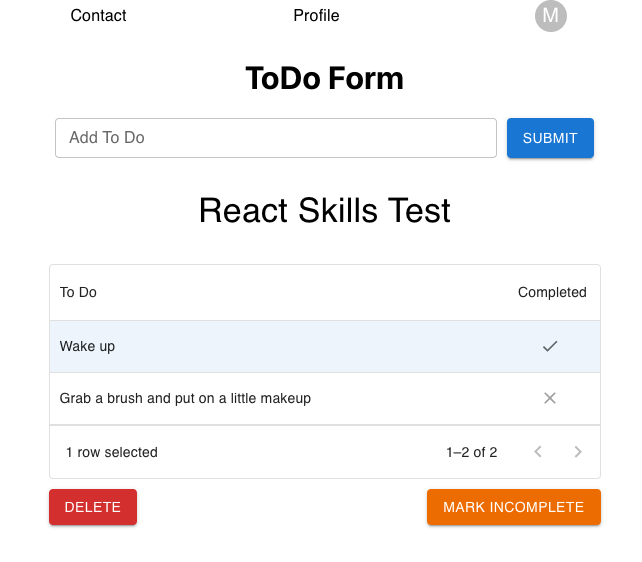

# LTK Skills Lab
This project is for testing applicants skills with different technologies used at LTK.  Completed by Ryan Maas on Sun 7/9/2023.


## React Skills Test - Lender Tool Kits
This project is a part of a React skills test for Lender Tool Kits. The project is a simple To-do List application built using React, Formik for forms, and Redux for state management. The application also includes a To-do form that opens when you click on an account menu button, and a table that displays the To-do items with delete functionality.


### Prerequisites
Ensure that you have the following installed on your local machine:

* [Visual Studio Code](https://code.visualstudio.com/)
* [Node JS (version 16+)](https://nodejs.org/en/download/)


### Installation
1. Clone this repository
```bash
git clone https://github.com/unomaas/LTK.SkillsLab.git
```

2. Change into the skills-test-react directory
```bash
cd skills-test-react
```
3. Install the project dependencies
```bash
npm install
```
4. Start the application
```bash
npm start
```
Your application should be up and running on localhost:3000!


### Built With
React - The web framework used

Formik - Form handling in React

Redux - State Management

Material UI - UI library


### Application Screenshot



#### Project Structure
```
skills-test-react
├── src
│   ├── index.js       # Root Component
│   ├── App.js         # Main App Component
│   ├── BasicForm.js   # Formik form to add To-do items
│   ├── TodoTable.js   # DataGrid to display To-do items with delete functionality
│   ├── AccountMenu.js # Account menu button to toggle To-do form
│   └── redux
│       └── store.js   # Redux actions and reducers
├── package.json
├── README.md
```


## Node.js & Express Skills Test - Lender Tool Kits

This project is a part of Express and Node.js skills test for Lender Tool Kits. The project is a simple REST API built using Express and Node.js. The application includes a loan object schema, and a data storage method of my choosing (Postgres). The API has basic CRUD operations, including GET, POST, PUT, and DELETE.


### Getting Started
These instructions will get you a copy of the project up and running on your local machine for development and testing purposes.


### Prerequisites
Ensure that you have the following installed on your local machine:

* [Visual Studio Code](https://code.visualstudio.com/)
* [Node JS (version 16+)](https://nodejs.org/en/download/)
* [Postgres](https://www.postgresql.org/download/)


### JSON vs Postgres
If the user does not have a Postgres connection established, the API will default to using JSON data to test with instead. To use Postgres, you will need to configure the database and install the pg module.


### Configuring the Database
The application uses pg to connect to a PostgreSQL database. You can configure the database connection by editing the config object in pool.js. Here is a sample configuration:

```javascript
config = {
    host: "localhost",
    port: 5432,
    database: "ltk_api", // Your database name should replace this.
    max: 10,
    idleTimeoutMillis: 30000
}
```

The SQL script to create the loan table in your PostgreSQL database and insert some initial data is provided in the `database.sql` file. You can execute these queries using your preferred PostgreSQL client.


### Installation
1. Clone this repository
```bash
git clone https://github.com/unomaas/LTK.SkillsLab.git
```

2. Change into the MockAPILab directory
```bash
cd MockAPILab
```
3. Install the project dependencies
```bash
npm install
```
4. Start the application
```bash
npm start
```

Your server should be up and running on localhost:3000!


### Usage
The server provides the following endpoints for managing loans and borrowers:

1. `GET /ltk/loanData/fetch-all-loans`: Fetch all loan objects.
2. `GET /ltk/loanData/fetch-loan-by-id/:id`: Fetch a single loan object based on loanId.
3. `POST /ltk/loanData/add-loan`: Add a new loan object with an array of borrowers.
4. `PUT /ltk/loanData/update-loan/:loanId/:pairId`: Update borrower information based on loanId and pairId.
5. `PUT /ltk/loanData/update-loan-delete-borrower/:loanId/:pairId`: Remove a borrower from a loan based on loanId and pairId.
6. `DELETE /ltk/loanData/delete-loan/:id`: Remove a loan object based on loanId. 

The server responds with a JSON object. For GET requests, this object contains the requested loan(s). For POST, PUT, and DELETE requests, the server responds with an HTTP status code to indicate success or failure.


### Testing
You can run the tests for the application using the command npm test. The tests are written using Jest.


### Built With
Node.js - The JavaScript runtime used

Express.js - The web framework used

Postgres - The database used

Jest - Testing framework

Axios - Promise based HTTP client for the browser and node.js


#### Project Structure
```
MockAPILab
├── routes
│   └── ltk
│       └── index.js   # Routes for the API
├── index.js           # Root file
├── app.test.js        # Jest tests
├── pool.js            # Database connection
├── database.sql       # SQL script to create the loan table and insert some initial data
├── dummyData.js       # Sample data for testing
├── package.json
├── readme.md
```


## Notes 
This is a project built for fun and to test my skills. I am not affiliated with Lender Tool Kits in any way.

